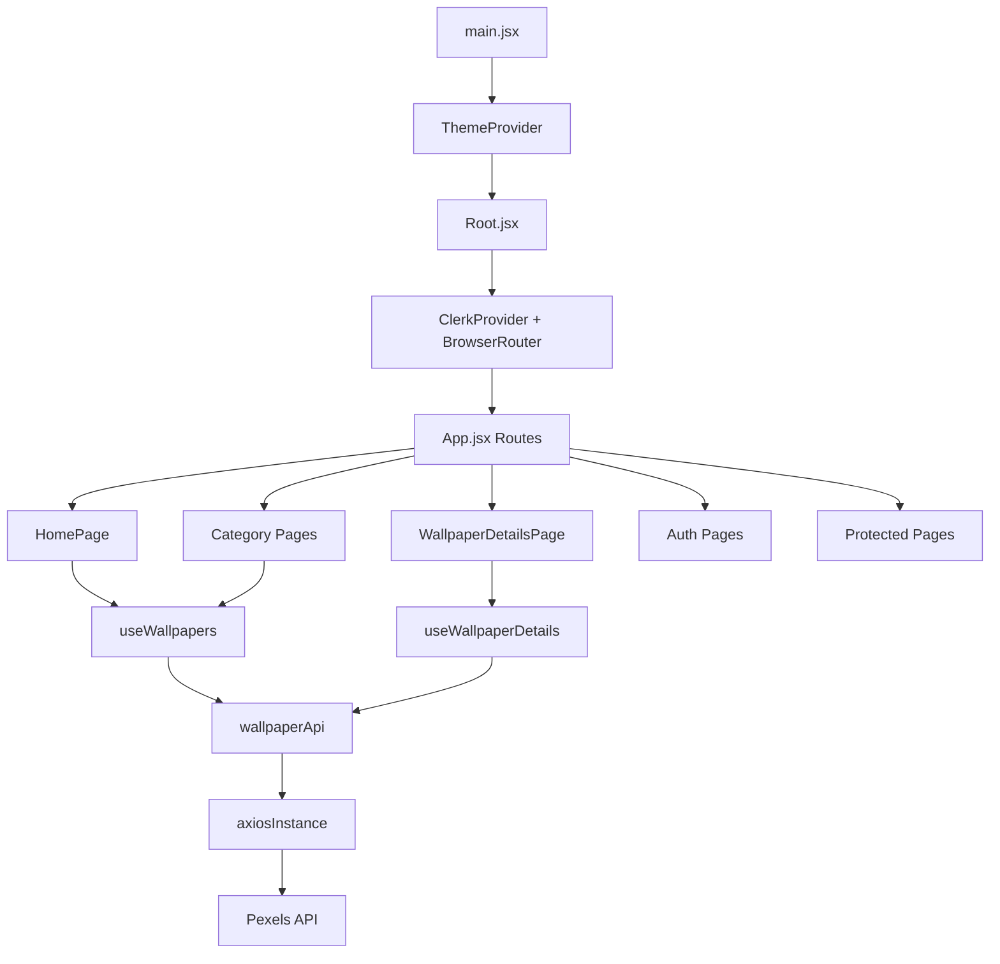

# Wallpaper App - Project Guide

This document is a single-source walkthrough of the whole codebase so you can quickly understand how the app is organized, how data moves, and where to make changes.

## 1) What This App Does

Wallpaper App is a React + Vite web app that:

- Shows curated and searchable wallpapers from the Pexels API.
- Supports discovery routes by category and tag.
- Has SEO-friendly wallpaper detail URLs and metadata.
- Uses Clerk for authentication (sign in/sign up/profile).
- Protects member routes (`/dashboard`, `/profile`) with a custom lock screen.
- Lets signed-in users save favourite wallpapers and keeps a personal download history.
- Shows API-driven pagination with a compact page window instead of rendering every page number.
- Supports light/dark theme with persisted preference.

## 2) Tech Stack

- Runtime: React 19, React Router, Axios
- Build tool: Vite 8
- Styling: Tailwind CSS 4 + custom global styles
- Auth: Clerk (`@clerk/clerk-react`)
- Motion/UI polish: Framer Motion (dependency present)
- Linting: ESLint 10

## 3) App Boot Sequence

1. `src/main.jsx`
   - Loads global CSS.
   - Wraps app in `ThemeProvider`.
2. `src/Root.jsx`
   - Reads `VITE_CLERK_PUBLISHABLE_KEY`.
   - Mounts `ClerkProvider` with theme-aware Clerk appearance.
   - Wraps app with `BrowserRouter`.
3. `src/App.jsx`
   - Defines routes and lazy-loaded pages.
   - Applies robot meta behavior (`noindex` for auth/private routes).
   - Renders global navbar and page shell.

## 4) High-Level Architecture

## 5) Route Map

### Public routes

- `/` -> curated wallpaper listing
- `/discover/:categorySlug` -> category-based discovery listing
- `/topics/:tagSlug` -> tag-based discovery listing
- `/categories` -> static category cards
- `/categories/:slug` -> category wallpaper results
- `/wallpapers/:wallpaperId`
- `/wallpapers/:wallpaperId-:wallpaperSlug` (canonical SEO format)

### Auth routes

- `/sign-in/*`
- `/sign-up/*`
- `/forgot-password`
- `/verify-email/*`

### Protected routes

- `/dashboard`
- `/profile/*`

Unknown routes redirect to `/`.

## 6) Folder-by-Folder Ownership

## `src/components/common`

- App-wide primitives (theme, auth wrappers, shared fallbacks, user menu).
- `ThemeProvider.jsx` + `themeContext.js` + `useTheme.js`: central theme state.
- `ProtectedRoute.jsx`: signed-in guard with branded fallback for signed-out users.

## `src/components/layout`

- `Navbar.jsx`: global header, auth CTAs, theme toggle, and user menu.

## `src/features/wallpapers`

Core domain feature. Most behavior lives here.

- `api/wallpaperApi.js`
  - `getWallpapers(page, perPage)` curated feed
  - `searchWallpapers(query, page, perPage)`
  - `getWallpaperById(photoId)`
- `hooks/useWallpapers.js`
  - Handles list fetch, deferred search, sorting, loading/error/retry, and API-driven pagination state.
- `hooks/useWallpaperDetails.js`
  - Handles single wallpaper fetch by ID, loading/error/retry.
- `hooks/useDownloadHistory.js`
  - Persists per-user download history in localStorage and keeps the newest 20 entries.
- `hooks/useDocumentMetadata.js`
  - Updates title, meta description, og tags, and canonical URL metadata.
- `constants/discoveryRoutes.js`
  - Source of category/tag discovery slugs and query seeds.
- `utils/wallpaperSeo.js`
  - SEO helpers for titles, descriptions, alt text, slugs, canonical wallpaper paths.
- `utils/slugify.js`
  - Slug parsing and generation for wallpaper URLs.
- `components/*`
  - Listing grid, cards, filters, pagination, details helpers, error/empty/skeleton states.

## `src/features/favourites`

- `hooks/useFavourites.js`
  - Persists favourite wallpapers in localStorage per Clerk user ID.
  - Exposes `isFavourite`, `toggleFavourite`, and `removeFavourite`.

## `src/features/categories`

- Static categories and presentation:
  - card/grid components
  - constants
  - simple `useCategories` hook wrapper

## `src/features/auth`

- Folder exists for auth-specific expansion (API/hooks/utils).
- Current auth UX is primarily in `src/pages/Login/*` plus Clerk components.

## `src/pages`

- Route-level composition layer:
  - `Home/HomePage.jsx`: listing screen, search/sort/pagination + discovery slug support.
  - `Categories/*`: categories index and category detail listing.
  - `WallpaperDetails/WallpaperDetailsPage.jsx`: detail experience + canonical redirect + save/download actions.
  - `Login/*`: sign-in/up/verify/forgot/profile pages.
  - `Home/DashboardPage.jsx`: protected dashboard with user profile summary, favourites, and download history.

## `src/services`

- `axiosInstance.js`: shared axios client configured for Pexels base URL and API key header.

## `src/utils`

- `clerkAppearance.js`: centralized Clerk UI theming and component class overrides.

## 7) Data Flow (Wallpapers)

1. UI pages call hooks (`useWallpapers` or `useWallpaperDetails`).
2. Hooks call API methods in `wallpaperApi`.
3. API methods use shared `axiosInstance`.
4. Axios sends authenticated requests to Pexels.
5. Hooks normalize state (`loading`, `error`, `retry`, data).
6. Components render loading/empty/error/success states.

### Important behavior details

- Search in `useWallpapers` is deferred via `useDeferredValue` to reduce UI jitter.
- Sorting currently supports photographer asc/desc and runs client-side.
- Pagination is derived from the Pexels `total_results` response and clamped in `useWallpapers`.
- The pagination UI renders a compact window around the current page with ellipsis, plus first/last pages.
- Listing page metadata and detail page metadata are both generated for SEO.
- Detail route enforces canonical slug URL using `Navigate` when needed.
- Wallpaper details can save/remove favourites and record download events for signed-in users.

## 8) Authentication and Access Control

- Clerk is mounted at root with publishable key from env.
- Navbar switches between signed-out actions and signed-in user menu.
- Protected routes are wrapped by `ProtectedRoute`, which displays an in-app premium lock screen instead of abrupt redirect.
- App-level robot meta marks auth/private routes as `noindex,nofollow`.
- Favourites and download history are stored per Clerk user ID in localStorage, so each signed-in user sees their own saved items on the same browser.

## 9) Theme System

- Theme stored in localStorage (`wallpaper-theme`).
- Initial theme prefers local storage value, else OS preference.
- `ThemeProvider` toggles the `dark` class on `<html>`.
- Clerk appearance is regenerated based on current theme for visual consistency.

## 10) Personalization Storage

- Theme preference is stored in localStorage under `wallpaper-theme`.
- Favourites are stored under `wallpaper-favourites-<clerkUserId>`.
- Download history is stored under `wallpaper-downloads-<clerkUserId>`.
- Download history is capped to the newest 20 entries.

## 11) SEO, Sitemap, and Robots

- `useDocumentMetadata` updates document metadata per route.
- `scripts/generate-sitemap.mjs` runs after build:
  - includes static routes (home/discovery/tag)
  - fetches curated wallpapers from Pexels and adds detail URLs
  - writes `public/sitemap.xml` and `public/robots.txt`
  - also writes into `dist/` when it exists

## 12) Environment Variables

Required in `.env.local`:

- `VITE_CLERK_PUBLISHABLE_KEY`
- `CLERK_SECRET_KEY`
- `VITE_PEXELS_API_KEY`
- Optional for sitemap absolute URLs: `VITE_SITE_URL`

Do not commit real secret values.

## 13) Commands

- Install: `npm install`
- Dev: `npm run dev`
- Lint: `npm run lint`
- Build: `npm run build`
  - Runs Vite build
  - Then generates sitemap + robots
- Preview production build: `npm run preview`

## 14) Quick Change Guide

If you need to change a specific area, start here:

- Add a new listing filter -> `src/features/wallpapers/hooks/useWallpapers.js` and relevant UI in `src/features/wallpapers/components`.
- Change pagination windowing or page-count rules -> `src/features/wallpapers/hooks/useWallpapers.js` and `src/features/wallpapers/components/Pagination.jsx`.
- Change saved wallpapers behavior -> `src/features/favourites/hooks/useFavourites.js` and `src/pages/WallpaperDetails/WallpaperDetailsPage.jsx`.
- Change download history behavior -> `src/features/wallpapers/hooks/useDownloadHistory.js` and `src/pages/Home/DashboardPage.jsx`.
- Add a new discovery category/tag -> `src/features/wallpapers/constants/discoveryRoutes.js`.
- Change detail SEO rules -> `src/features/wallpapers/utils/wallpaperSeo.js`.
- Change auth gating UX -> `src/components/common/ProtectedRoute.jsx`.
- Change Clerk form branding -> `src/utils/clerkAppearance.js`.
- Change navigation links -> `src/components/layout/Navbar.jsx`.

## 15) Current Architecture Notes

- The app is feature-oriented around wallpapers and route-oriented at page level.
- State management is hook-local (no Redux/Zustand currently), which keeps logic simple.
- User-specific personalization is browser-local today; there is no backend sync for favourites or download history yet.
- Some folders (`src/routes`, parts of `src/features/auth`, etc.) are placeholders for future growth.
